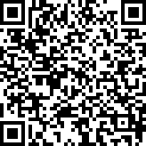

# QR Generator

## Build
`cargo build`

## Run

- Output as plain ascii
  `echo "some text here" | cargo run`

- Output as png
  `echo "will be png" | cargo run -- --output new_qr.png --size 400`

## Build to executable file

- `./build.sh`
- Output files will be in target/release/bin

## Example

Example for metadata QR:

`echo '{"houseId":"od-phahol","testText":"@!^&*"}' | ./target/release/bin/qr_generator --output meta.png`

Example for S3 config QR:

`echo '{ "bucket": "vbsupload", "region": "ap-southeast-1", "access_key": "AKIAXXXXXXXXX", "secret_key": "nO5qnXXXXXXXXX" }' | ./target/release/bin/qr_generator --output config.png`

